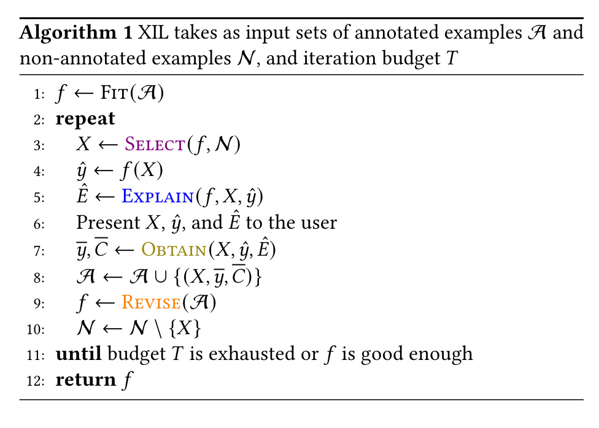

<!-- #region -->
# Programming Framework of XIL Typology
Repository for the paper [A Typology to Explore and Guide Explanatory Interactive Machine Learning](https://arxiv.org/abs/2203.03668). All developed components use the PyTorch library and are evaluated on CV tasks. This repository implements and examines the following XIL methods:

* Right for Right Reason (RRR) (Ross et al., 2017)
* Right for the Better Reason (RBR) (Shao et al., 2021)
* Right for the Right Reason GradCAM (RRR-G) (Schramowski et al., 2020)
* Human Importance-aware Network Tuning (HINT) (Selvaraju et al., 2019)
* Contextual Decomposition Explanation Penalization (CDEP) (Rieger et al., 2019)
* Counterexamples (CE) (Teso & Kersting, 2019).



## Overview
As machine learning models become increasingly larger, trained weakly supervised on large, possibly uncurated data sets, it becomes increasingly important to establish mechanisms for introspecting, interacting, and revising models to guarantee their learned knowledge is aligned with human knowledge. 
The here presented XIL framework was developed for this purpose. 
Besides implementing the general XIL framework, we also provide and implement a toolbox for existing and novel metrics and benchmarks for evaluating the overall abilities of a XIL method.

## Requirements
We use Python3 (3.8.10) and the PyTorch library. For all packages please `pip install -r requirements.txt`. Furthermore, we use the NVIDIA docker-image [21.07](https://docs.nvidia.com/deeplearning/frameworks/pytorch-release-notes/rel_21-07.html#rel_21-07 "21.07"). We added the Dockerfile to make reproduction easier.

## How to use it?
To train a model with a certain XIL method and dataset, e.g. use 

```
python main_MNIST.py --mode RRR --dataset MNIST
``` 

The expected output is a learning procedure where the train and test accuracy and loss are shown over time. Without XIL (i.e. `--mode Vanilla`) the model relies on the decoy/ confounder, there is a big difference between train and test accuracy. With a XIL method this difference is small, i.e. the model is successfully revised via XIL. The run-time on a NVIDIA V100 GPU is less than 2min and on a normal desktop PC with GTX1080 it is less than 15min. The data for this experiment is automatically downloaded and stored by our scripts (see `data_store/datasets.py`). The passed arguments are explained in each file.

Next, we can evaluate the previously trained model with the WR metric (see paper). The *method* argument specifies for which explanation method to evaluate. Here, multiple arguments are also possible.

```
python wrong_reason_MNIST.py --mode RRR --dataset MNIST --method GradCAM IG LIME
``` 

This yields percentage values of how strong the model relies on a confounder. Lower values are better. The run time is a couple of seconds for GradCAM and IG while it is up to an hour for LIME.

Further experiments of the paper can be conducted with the following scripts: `switch_xil_on.py`, `interaction_efficiency.py`, and `robustness.ipnyb`. These scripts evaluate a XIL-revised model with different tasks and benchmarks beyond accuracy. They follow the same instructions as above and contain descriptions within the scripts about which argument to use and when.

With `visualize_explanations.ipynb` heatmaps can be generated and visualized in order to get qualitative results.

## Framework structure
The following describes and explains the core components/modules:

* `xil_methods`: Implements the XIL loss functions in `xil_loss.py` and functions for the generation of counterexamples in `ce.py`. 
* `learner`: Package that contains classes and functions related to a ML learner. `models/dnns.py` implements different neural networks (SimpleConvNET, VGG16). `learner.py` implements a ML learner with different properties and provides the training routines (`fit()`, `fit_isic()`, `fit_n_expl_shuffled_dataloader()`) as well as some utility functions for scoring/storing/loading a learner. Trained models are stored in the `model_store`.
* `data_store`: Place for all dataset-related stuff. `datasets.py` currently implements three datasets (DecoyMNIST, DecoyFMNIST and ISIC Skin Cancer 2019). `rawdata` contains utility functions for setting up and downloading raw data. 
* `explainer.py`: Collection of explainer methods used to visualize explanations. Uses the captum library for the GradCAM method. Provides functions to quantify Wrong Reason (WR metric) for IG, LIME and GradCAM. 
* `util.py`: Utilzation functions.
* `main_MNIST.py`: Implements the main setup for the DecoyMNIST/FMNIST experiments.  
* `main_isic.py`: Implements the main setup for the ISIC19 experiments.
* `wrong_reason_MNIST.py`: Quantify WR for the DecoyMNIST/FMNIST experiments.
* `wrong_reason_isic.py`: Quantify WR for the ISIC19 experiments.
* `runs`: Folder to store outputs 

## Contact
**Author:** Felix Friedrich  
**Institution:** Technische Universität Darmstadt (2022)  
**Department:** Machine Learning Lab, Computer Science, TU Darmstadt, Germany   
**Mail:** <friedrich@cs.tu-darmstadt.de>

## Citation
If you like or use our work please cite us:
```bibtex
@article{friedrich2022XIL_typo,
      title={A Typology to Explore and Guide Explanatory Interactive Machine Learning}, 
      author={Felix Friedrich and Wolfgang Stammer and Patrick Schramowski and Kristian Kersting},
      year={2022},
      journal={arXiv preprint arXiv:2203.03668}
}
```
<!-- #endregion -->
